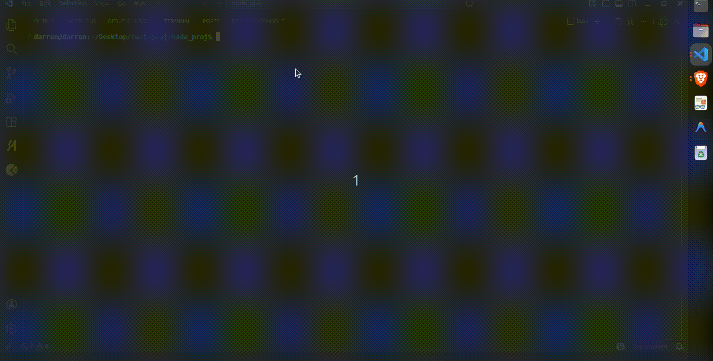

# mini-porter — CLI PaaS for Kubernetes

## Demo



---

## About

mini-porter is a minimal Platform-as-a-Service (PaaS) CLI that lets you deploy applications to Kubernetes with a single command.

Deploy your app with:
```bash
mini-porter deploy
```

##What it does

mini-porter abstracts away Kubernetes complexity and handles:

* Docker image build & push
* Kubernetes Deployment creation
* Service exposure (NodePort / LoadBalancer)
* Ingress + routing
* Environment-aware networking

---

## Features
* Project Setup
  - Generate config with `mini-porter init`
  - Zero boilerplate, works with any app
* Authentication
  - One-command credential setup: `mini-porter login`
* Cluster Management
  - Create clusters: `mini-porter cluster create`
  - List clusters: `mini-porter cluster list`
  - Delete clusters: `mini-porter cluster delete`
* Deployment
  - One-command deploy: `mini-porter deploy`
  - Automatically builds Docker images and pushes to registry
  - creates Deployments & Services
* Smart Networking
  - Local → NodePort
  - Cloud → LoadBalancer
  - Prints correct access URL automatically
* Observability
  - `mini-porter status` for health checks
  - Detects:
    pod readiness
    auth failures
    networking issues
* Cleanup
  - mini-porter delete for full teardown

---

## Architecture

```
CLI (Cobra)
   ↓
Orchestrator (deploy logic)
   ↓
--------------------------------
| Docker | Kubernetes | Config |
--------------------------------
```

* **cmd/** → CLI commands
* **internal/** → core logic (Docker, K8s, deploy orchestration)
* **examples/** → sample app for testing

---

## Installation

### Option 1 — Build locally

```bash
git clone https://github.com/darrendc26/mini-porter.git
cd mini-porter
go build -o mini-porter
sudo mv mini-porter /usr/local/bin/
```

---

### Option 2 — Go install

```bash
go install github.com/darrendc26/mini-porter@latest
```

---

## Prerequisites

Ensure the following are installed and running before using mini-porter:

* Docker (for building and pushing container images)
* Kubernetes cluster (e.g., Minikube or kind)
* kubectl configured to access your cluster

---

### Verify setup

```bash
docker --version
kubectl get nodes
```

---

## Requirements

To deploy an application, your project must include:
Literally nothing... Just a working application is all that's needed.

---

## Example App Usage

### 1. Navigate to your app

```bash
cd examples/node-app
# Generates a mini-porter.yaml file
mini-porter init
```
---
```bash
#  To deploy to a cloud cluster
mini-porter login -p <credentials.json> -P <cloud-provider>

mini-porter cluster create --env gcp  --project-id <project-id> --region <region> --name <cluster-name>

# To deploy to a local cluster
mini-porter cluster create --env local
```
---

### 2. Deploy

```bash
mini-porter deploy
```

---

### 3. Resize your GKE cluster
```bash
mini-porter resize -p <project-id> -r <region> -n <cluster-name> -s <size>
```
---

### 4. Check status

```bash
mini-porter status
```

---

### 5. Delete deployment

```bash
# Deletes the entire app deployment
mini-porter delete

```

---

## How it works

mini-porter performs:

1. Builds Docker image
2. Pushes image to registry
3. Creates Kubernetes Deployment
4. Exposes Service 
5. Creates Ingress for domain routing
6. Sets up postgres and redis databases (if needed)
7. Prints correct access URL automatically

---

## Design Decisions

* **Environment-aware networking**
  → NodePort (local) vs LoadBalancer (cloud)

* **YAML config (****`mini-porter.yaml`****)**
  → Explicit and predictable deployments

* **No Helm**
  → Full control over Kubernetes resources

* **Orchestrator pattern**
  → Clean separation between CLI and infra logic

---

## Example App

A sample Node.js app is included:

```bash
examples/node-app/
```

Use it to test the full deployment flow.

---

## Future Improvements

* Ingress auto-setup (no manual hosts entry)
* HTTPS support (cert-manager)
* Autoscaling (HPA)
* Multi cloud support (AWS/GCP)
* Web dashboard

---

## Why this project

mini-porter was built to understand and demonstrate:

* Containerization workflows
* Kubernetes resource management
* Infrastructure orchestration
* CLI design patterns in Go

---

## License

MIT License
